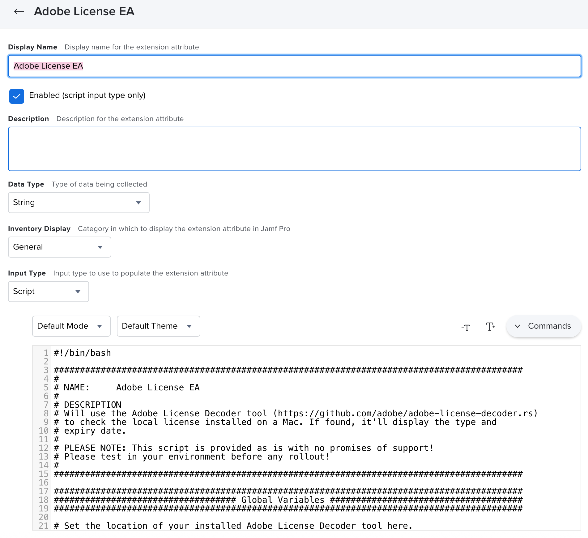

**Adobe License EA**

**Note:** In order to use this EA, it expects the Adobe License Decoder (https://github.com/adobe/adobe-license-decoder.rs) to be installed in the location `/Library/Adobe License Decoder/adobe-license-decoder`
If you wish to have this somewhere else, change the `adl` variable at [line 22] (https://github.com/Daz-wallace/blog-snippets/blob/master/Adobe%20License%20Decoder/Adobe%20License%20EA.sh#L22).

**Setup**

Add this script to a new Jamf Pro [Extension Attribute] (https://docs.jamf.com/jamf-pro/administrator-guide/Computer_Extension_Attributes.html) as a script type. 

**Expected Values**

There are 4 main outputs to expect:

*"Adobe License Decoder not installed"*

This is shown if the EA can't find the installed copy of the Adobe License Decoder

*"NUL / Unlicensed"*

This is shown if the Adobe License Decoder returns a non-0 exit code. The command line output will be something like:
> thread 'main' panicked at 'No such file or directory (os error 2): /Library/Application Support/Adobe/OperatingConfigs', src/main.rs:24:13
> note: run with `RUST_BACKTRACE=1` environment variable to display a backtrace
This normally means that the device is either unlicensed or is using a Named USer License or NUL.

*"License Type: XXX*

*License Expiry Date: YYY"*

This is shown if a valid FRL or SDL is detected. It'll show both the type and the expiry date directly as the Adobe License Decoder shows them.

*"Unexpected output, please review"*

This is shown if the EA encounters something unexpected. Maybe the exit codes or text has changed. I'd suggest running the binary from the command line and seeing what's up. PRs accepted ;) 
